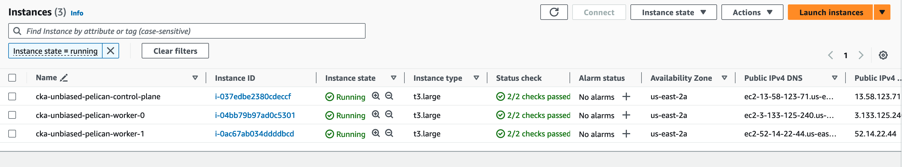

# kubeadm-cluster-builder-aws-terraform
**Tom Dean - 12/30/2023**

## Introduction

### The Need: A Quick and Repeatable Local Kubernetes Cluster Using AWS

I had been studying for the Cloud Native Computing Foundation's CKA and CKAD certification exams for a while, and recently passed both exams.  Anyone who is familiar with these exams knows that, in order to practice your Kubernetes skills, you're going to need a cluster.  Hands-on experience with Kubernetes clusters, of the `kubeadm` variety, is key to passing the CKA.  You need to be experienced with deploying, break/fix and upgrading `kubeadm` clusters.

What's needed is a pre-deployed set of Ubuntu Linux nodes that can be used to meet these needs.

***So, how do we get from here to there?***

### The Details: A Single-File Terraform Solution

[Terraform code](main.tf)

I like to K.I.S.S. (Keep It Simple, Stupid!) whenever possible, and this was a case where I could put everything into a single file.  Yeah, yeah, yeah, why all the variables when we could just set them down in the module?  Because, I like to separate the input from the machinery.

You can change *all kinds of things* in the variables.

**Node count, by node type:**
```bash
variable "control_plane_count" {
  type    = number
  default = 1
}

variable "worker_count" {
  type    = number
  default = 2
}
```

**Node sizing, by node type:**
```bash
variable "control_plane_instance_type" {
  type    = string
  default = "t3.large"
}

variable "worker_instance_type" {
  type    = string
  default = "t3.large"
}
```

Feel free to customize as needed.  The virtual machine sizing is based on my past experience, but you might be able to tighten things up on disk and/or instance size and run an acceptable cluster.  Alternatively, if you want to build clusters with more nodes, go for it!  These are **practice clusters**.

## References

[Terraform code](main.tf)

[kubernetes.io: Bootstrapping clusters with kubeadm](https://kubernetes.io/docs/setup/production-environment/tools/kubeadm/)

[kubernetes.io: Container Runtimes](https://kubernetes.io/docs/setup/production-environment/container-runtimes/)

[GitHub: CRI-O Installation Instructions](https://github.com/cri-o/cri-o/blob/main/install.md#readme)

[Docker: Install Docker Engine on Ubuntu](https://docs.docker.com/engine/install/ubuntu/)

[kubernetes.io: Installing kubeadm](https://kubernetes.io/docs/setup/production-environment/tools/kubeadm/install-kubeadm/)

[tigera.io: Install Calico networking and network policy for on-premises deployments](https://docs.tigera.io/calico/latest/getting-started/kubernetes/self-managed-onprem/onpremises)

## Prerequisites

Before we get started, we're going to need to confirm that we have some things *installed and configured*.

### Terraform

[Hashicorp: Official Packaging Guide](https://www.hashicorp.com/official-packaging-guide)

[Install Terraform](https://developer.hashicorp.com/terraform/tutorials/aws-get-started/install-cli)

I've written quite a bit of infrastructure-as-code in Terraform, using AWS, for lab environments and projects in the past, so I decided to try my hand with Terraform + KVM/`libvirt` to provide IaC automation for my projects.

To install, you first need to add the repositories for Hashicorp, as described in the link above.  Follow the steps for your operating system.  Once the repositiories have been added, you can install Terraform as instructed in the links above.

**You can verify your installation by checking the version of Terraform:**
```
terraform --version

```

You should get the installed version of Terraform back.

***Ok, Terraform is good to go.  Let's check KVM.***

### AWS CLI

[]()

[]()

[]()

[]()

You're going to need to have the AWS CLI installed and configured.  I've provided reference links for this.

**Once you have the AWS CLI installed, let's give it a test:**
```bash

```

### Git Clone the `kubeadm-cluster-builder-aws-terraform` Code

[GitHub: kubeadm-cluster-builder-aws-terraform](https://github.com/southsidedean/kubeadm-cluster-builder-aws-terraform)

Head on over to the `kubeadm-cluster-builder-aws-terraform` GitHub repository in the link above.  Go ahead and clone the repository to a directory of your choice.

**Clone repository:**
```bash
git clone https://github.com/southsidedean/kubeadm-cluster-builder-aws-terraform.git

```

**SAMPLE OUTPUT:**
```bash

```

**Change directory into the repository directory:**
```bash
cd kubeadm-cluster-builder-aws-terraform

```

**Let's take a look at the Terraform code:**
```bash
more main.tf

```

[Terraform code](main.tf)

You can see that the code is configurable via the numerous variables at the beginning of the file.  By default, a cluster will be created with a single control plane node and two worker nodes.  Feel free to adjust the values as you see fit.

***Ok, we're all ready to start deploying a cluster.  Let's go!***

## Deploy a Kubernetes Cluster Using Terraform and AWS

### Deploy the Kubernetes Nodes Using Terraform

Ok, let's deploy a cluster!

**First, we need to initialize our Terraform environment:**
```bash
terraform init

```

**SAMPLE OUTPUT:**
```bash
Initializing the backend...

Initializing provider plugins...
- Finding hashicorp/aws versions matching "~> 5.0"...
- Finding latest version of hashicorp/random...
- Finding latest version of hashicorp/tls...
- Installing hashicorp/aws v5.31.0...
- Installed hashicorp/aws v5.31.0 (signed by HashiCorp)
- Installing hashicorp/random v3.6.0...
- Installed hashicorp/random v3.6.0 (signed by HashiCorp)
- Installing hashicorp/tls v4.0.5...
- Installed hashicorp/tls v4.0.5 (signed by HashiCorp)

Terraform has created a lock file .terraform.lock.hcl to record the provider
selections it made above. Include this file in your version control repository
so that Terraform can guarantee to make the same selections by default when
you run "terraform init" in the future.

Terraform has been successfully initialized!

You may now begin working with Terraform. Try running "terraform plan" to see
any changes that are required for your infrastructure. All Terraform commands
should now work.

If you ever set or change modules or backend configuration for Terraform,
rerun this command to reinitialize your working directory. If you forget, other
commands will detect it and remind you to do so if necessary.
```

**Let's validate our Terraform code:**
```bash
terraform validate

```

**SAMPLE OUTPUT EXCERPT:**
```bash
Success! The configuration is valid.
```

**Next, let's generate a Terraform plan:**
```bash
terraform plan -out cka-plan.plan

```

**SAMPLE OUTPUT EXCERPT:**
```bash
data.aws_iam_policy_document.instance-assume-role-policy: Reading...
data.aws_caller_identity.current: Reading...
data.aws_ami.ubuntu_ami: Reading...
data.aws_iam_policy_document.instance-assume-role-policy: Read complete after 0s [id=2851119427]
data.aws_caller_identity.current: Read complete after 0s [id=445551320589]
data.aws_ami.ubuntu_ami: Read complete after 1s [id=ami-05fb0b8c1424f266b]

Terraform used the selected providers to generate the following execution plan. Resource actions are indicated with the following symbols:
  + create

Terraform will perform the following actions:
...
```

This will show us what Terraform is going to build, and will validate our code for errors.  With no errors, let's proceed with a `terraform apply`.

**Deploy cluster:**
```bash
terraform apply -auto-approve cka-plan.plan

```

Terraform will handle all the heavy lifting for us and will build the environment as we requested.

**SAMPLE OUTPUT EXCERPT:**
```bash
random_pet.pet: Creating...
tls_private_key.cluster_key: Creating...
random_pet.pet: Creation complete after 0s [id=unbiased-pelican]
tls_private_key.cluster_key: Creation complete after 0s [id=981bec5bb3a104abcb8bdff01b8efb36058a9d29]
aws_key_pair.cluster_key: Creating...
aws_vpc.course_vpc: Creating...
aws_iam_role.kubeadm-control-plane-role: Creating...
aws_iam_role.kubeadm-worker-role: Creating...
aws_key_pair.cluster_key: Creation complete after 0s [id=cluster_key_20231231050318681800000001]
aws_iam_role.kubeadm-control-plane-role: Creation complete after 0s [id=kubeadm-control-plane-role]
aws_iam_instance_profile.kubeadm-control-plane-role-instance-profile: Creating...
aws_iam_role.kubeadm-worker-role: Creation complete after 0s [id=kubeadm-worker-role]
aws_iam_instance_profile.kubeadm-worker-role-instance-profile: Creating...
aws_iam_instance_profile.kubeadm-control-plane-role-instance-profile: Creation complete after 0s [id=kubeadm-control-plane-role-instance-profile]
aws_iam_instance_profile.kubeadm-worker-role-instance-profile: Creation complete after 0s [id=kubeadm-worker-role-instance-profile]

...

Apply complete! Resources: 18 added, 0 changed, 0 destroyed.

Outputs:

cluster_key_name = "cluster_key_20231231050318681800000001"
cluster_private_key_openssh = <sensitive>
```

With a clean Terraform execution under our belt, we can proceed and check for our virtual machines using the AWS console or CLI.



***Our three nodes are ready!  For now, leave your cluster up!***

### EXAMPLE: Tear Down the Nodes Using Terraform

When you're done with the cluster, you use the `terraform destroy` command to tear down the cluster.

**Destroy cluster:**
```bash
terraform destroy -auto-approve

```

**SAMPLE OUTPUT:**
```bash
random_pet.pet: Refreshing state... [id=unbiased-pelican]
tls_private_key.cluster_key: Refreshing state... [id=981bec5bb3a104abcb8bdff01b8efb36058a9d29]
data.aws_caller_identity.current: Reading...
data.aws_iam_policy_document.instance-assume-role-policy: Reading...
aws_key_pair.cluster_key: Refreshing state... [id=cluster_key_20231231050318681800000001]
aws_vpc.course_vpc: Refreshing state... [id=vpc-060f9245bc50a3217]
data.aws_ami.ubuntu_ami: Reading...
data.aws_iam_policy_document.instance-assume-role-policy: Read complete after 0s [id=2851119427]
aws_iam_role.kubeadm-worker-role: Refreshing state... [id=kubeadm-worker-role]
aws_iam_role.kubeadm-control-plane-role: Refreshing state... [id=kubeadm-control-plane-role]
data.aws_caller_identity.current: Read complete after 0s [id=445551320589]
aws_iam_instance_profile.kubeadm-worker-role-instance-profile: Refreshing state... [id=kubeadm-worker-role-instance-profile]
aws_iam_instance_profile.kubeadm-control-plane-role-instance-profile: Refreshing state... [id=kubeadm-control-plane-role-instance-profile]
data.aws_ami.ubuntu_ami: Read complete after 1s [id=ami-05fb0b8c1424f266b]
aws_internet_gateway.default: Refreshing state... [id=igw-0bf71b672f8f5da82]

...

aws_subnet.course_subnet: Destruction complete after 0s
aws_iam_role.kubeadm-worker-role: Destruction complete after 0s
aws_security_group.cluster_ssh: Destruction complete after 0s
aws_security_group.common: Destruction complete after 0s
aws_vpc.course_vpc: Destroying... [id=vpc-060f9245bc50a3217]
aws_vpc.course_vpc: Destruction complete after 1s
random_pet.pet: Destroying... [id=unbiased-pelican]
random_pet.pet: Destruction complete after 0s

Destroy complete! Resources: 18 destroyed.
```

***Again, for now, leave your cluster up, or deploy a fresh set of nodes.  Let's build a Kubernetes cluster!***

## Deploy a Kubernetes Cluster on Our KVM Virtual Machines (Nodes)

To get started, we're going to log into each of our nodes with a separate connection (window/tab/etc), and become the `root` user.

**First, we'll need to retrieve the SSH key using Terraform:**
```bash
terraform output cluster_private_key_openssh | grep -v EOT > cluster_key.priv
chmod 600 cluster_key.priv

```

**Log in to each node using SSH:**
```bash
ssh -i cluster_key.priv ubuntu@<NODE_PUBLIC_IP_ADDRESS>

```

**Become the `root` user on all nodes:**
```bash
sudo su

```

When deploying a Kubernetes cluster, you have choices with regard to your container runtime.  I'm writing up TWO options, but feel free to experiment!

***CHOOSE ONE OPTION ONLY!  Option 1 is Docker/`containerd` and Option 2 is CRI-O.  ONE OPTION ONLY!***

### Option 1: Prepare the KVM Nodes Using the `containerd` Runtime

[kubernetes.io: Container Runtimes](https://kubernetes.io/docs/setup/production-environment/container-runtimes/)

[Docker: Install Docker Engine on Ubuntu](https://docs.docker.com/engine/install/ubuntu/)

***Choose this option to install the Docker/`containerd` runtime!***

#### Install Docker/`containerd` Software

***Perform the following steps on all nodes.***

**Uninstall existing versions of Docker/`containerd`:**
```bash
apt-get update
apt-get remove docker docker.io containerd runc

```

**Install software prerequisites, if needed:**
```bash
apt-get update
apt-get install -y ca-certificates curl gnupg

```

**Add Docker Repository GPG Keys:**
```bash
install -m 0755 -d /etc/apt/keyrings
curl -fsSL https://download.docker.com/linux/ubuntu/gpg | sudo gpg --dearmor -o /etc/apt/keyrings/docker.gpg
chmod a+r /etc/apt/keyrings/docker.gpg

```

**Add Docker Repository:**
```bash
echo "deb [arch="$(dpkg --print-architecture)" signed-by=/etc/apt/keyrings/docker.gpg] https://download.docker.com/linux/ubuntu "$(. /etc/os-release && echo "$VERSION_CODENAME")" stable" | sudo tee /etc/apt/sources.list.d/docker.list > /dev/null

```

**Install Docker/`containerd`:**
```bash
apt-get update
apt-get install -y docker-ce docker-ce-cli containerd.io docker-buildx-plugin docker-compose-plugin

```

**Add the `ubuntu` user to the `docker` group:**
```bash
usermod -aG docker ubuntu

```

**Enable/Start Docker:**
```bash
systemctl enable --now docker
systemctl status docker

```

**SAMPLE OUTPUT:**
```bash
Synchronizing state of docker.service with SysV service script with /lib/systemd/systemd-sysv-install.
Executing: /lib/systemd/systemd-sysv-install enable docker
● docker.service - Docker Application Container Engine
     Loaded: loaded (/lib/systemd/system/docker.service; enabled; vendor preset: enabled)
     Active: active (running) since Thu 2023-04-13 15:12:24 UTC; 37s ago
TriggeredBy: ● docker.socket
       Docs: https://docs.docker.com
   Main PID: 3292 (dockerd)
      Tasks: 9
     Memory: 24.5M
        CPU: 435ms
     CGroup: /system.slice/docker.service
             └─3292 /usr/bin/dockerd -H fd:// --containerd=/run/containerd/containerd.sock

Apr 13 15:12:21 control-plane-01 dockerd[3292]: time="2023-04-13T15:12:21.005925937Z" level=info msg="[core] [Channel #4 SubChannel #5] Subchannel Connectivity change to RE>
Apr 13 15:12:21 control-plane-01 dockerd[3292]: time="2023-04-13T15:12:21.006083496Z" level=info msg="[core] [Channel #4] Channel Connectivity change to READY" module=grpc
Apr 13 15:12:23 control-plane-01 dockerd[3292]: time="2023-04-13T15:12:23.894513044Z" level=info msg="Loading containers: start."
Apr 13 15:12:24 control-plane-01 dockerd[3292]: time="2023-04-13T15:12:24.187671369Z" level=info msg="Default bridge (docker0) is assigned with an IP address 172.17.0.0/16.>
Apr 13 15:12:24 control-plane-01 dockerd[3292]: time="2023-04-13T15:12:24.336796817Z" level=info msg="Loading containers: done."
Apr 13 15:12:24 control-plane-01 dockerd[3292]: time="2023-04-13T15:12:24.400227422Z" level=info msg="Docker daemon" commit=59118bf graphdriver=overlay2 version=23.0.3
Apr 13 15:12:24 control-plane-01 dockerd[3292]: time="2023-04-13T15:12:24.401304837Z" level=info msg="Daemon has completed initialization"
Apr 13 15:12:24 control-plane-01 dockerd[3292]: time="2023-04-13T15:12:24.665348647Z" level=info msg="[core] [Server #7] Server created" module=grpc
Apr 13 15:12:24 control-plane-01 systemd[1]: Started Docker Application Container Engine.
Apr 13 15:12:24 control-plane-01 dockerd[3292]: time="2023-04-13T15:12:24.674931732Z" level=info msg="API listen on /run/docker.sock"
```

We should see the `docker.service` service `enabled` and `active` on all nodes.  Press `q` to exit the `systemctl status docker` command.

There's an issue with the stock `/etc/containerd/config.toml` file and Kubernetes 1.26+.  We need to set the configuration file aside and restart the `containerd` service.

**Backup/disable existing `/etc/containerd/config.toml`:**
```bash
mv /etc/containerd/config.toml /etc/containerd/config.toml.bak
systemctl restart containerd

```

**Configure `/etc/containerd/config.toml`:**
```bash
containerd config default > /etc/containerd/config.toml
sed -i '/SystemdCgroup/s/false/true/' /etc/containerd/config.toml
sed -i '/sandbox_image/s/registry.k8s.io\/pause:3.6/registry.k8s.io\/pause:3.2/' /etc/containerd/config.toml
systemctl restart containerd

```
***Sweet, we have a container runtime installed!  What's next?***

#### Docker/`containerd`: Linux System Configuration Tasks

***Perform the following steps on all nodes.***

**Configure the `systemd` `cgroup` driver:**
```bash
touch /etc/docker/daemon.json
cat <<EOF > /etc/docker/daemon.json
{"exec-opts": ["native.cgroupdriver=systemd"]}
EOF
systemctl restart docker
docker info | grep Cgroup

```

**SAMPLE OUTPUT:**
```bash
 Cgroup Driver: systemd
 Cgroup Version: 2
```

**Load the overlay and br_netfilter modules:**
```bash
cat <<EOF | sudo tee /etc/modules-load.d/k8s.conf
overlay
br_netfilter
EOF
modprobe overlay
modprobe br_netfilter
lsmod | grep -E "overlay|br_netfilter"

```

**SAMPLE OUTPUT:**
```bash
overlay
br_netfilter
br_netfilter           32768  0
bridge                307200  1 br_netfilter
overlay               151552  0
```

**Configure kernel parameters for bridging and IPv4 forwarding:**
```bash
cat <<EOF | sudo tee /etc/sysctl.d/k8s.conf
net.bridge.bridge-nf-call-iptables  = 1
net.bridge.bridge-nf-call-ip6tables = 1
net.ipv4.ip_forward                 = 1
EOF

```

**SAMPLE OUTPUT:**
```bash
net.bridge.bridge-nf-call-iptables  = 1
net.bridge.bridge-nf-call-ip6tables = 1
net.ipv4.ip_forward                 = 1
```

**Apply kernel parameters:**
```bash
sysctl --system
```

**SAMPLE OUTPUT EXCERPT:**
```bash
...
* Applying /etc/sysctl.d/k8s.conf ...
net.bridge.bridge-nf-call-iptables = 1
net.bridge.bridge-nf-call-ip6tables = 1
net.ipv4.ip_forward = 1
...
```

***Ok, node configuration is complete.  Proceed to **Deploy the Kubernetes Cluster Using `kubeadm`** now.***

#### Option 2: Prepare the KVM Nodes Using the CRI-O Runtime

[kubernetes.io: Container Runtimes](https://kubernetes.io/docs/setup/production-environment/container-runtimes/)

[GitHub: CRI-O Installation Instructions](https://github.com/cri-o/cri-o/blob/main/install.md#readme)

***Choose this option to install the CRI-O runtime!***

##### Install and Configure CRI-O Runtime Software

***Perform the following steps on all nodes.***

**Add CRI-O Repositories:**
```bash
echo "deb [signed-by=/usr/share/keyrings/libcontainers-archive-keyring.gpg] https://download.opensuse.org/repositories/devel:/kubic:/libcontainers:/stable/xUbuntu_22.04/ /" > /etc/apt/sources.list.d/devel:kubic:libcontainers:stable.list
echo "deb [signed-by=/usr/share/keyrings/libcontainers-crio-archive-keyring.gpg] https://download.opensuse.org/repositories/devel:/kubic:/libcontainers:/stable:/cri-o:/1.22/xUbuntu_22.04/ /" > /etc/apt/sources.list.d/devel:kubic:libcontainers:stable:cri-o:1.22.list

```

**Add CRI-O Repository GPG Keys:**
```bash
mkdir -p /usr/share/keyrings
curl -L https://download.opensuse.org/repositories/devel:/kubic:/libcontainers:/stable/xUbuntu_22.04/Release.key | gpg --dearmor -o /usr/share/keyrings/libcontainers-archive-keyring.gpg
curl -L https://download.opensuse.org/repositories/devel:/kubic:/libcontainers:/stable:/cri-o:/1.22/xUbuntu_22.04/Release.key | gpg --dearmor -o /usr/share/keyrings/libcontainers-crio-archive-keyring.gpg

```

**Install CRI-O Packages:**
```bash
apt-get update
apt-get install -y cri-o cri-o-runc

```

**Set the `cgroup` driver:**
```bash
touch /etc/crio/crio.conf.d/02-cgroup-manager.conf
cat <<EOF > /etc/crio/crio.conf.d/02-cgroup-manager.conf
[crio.runtime]
conmon_cgroup = "pod"
cgroup_manager = "systemd"
EOF

```

**Override the Pause Container Image:**
```bash
touch /etc/crio/crio.conf.d/03-cgroup-pause.conf
cat <<EOF > /etc/crio/crio.conf.d/03-cgroup-pause.conf
[crio.image]
pause_image="registry.k8s.io/pause:3.6"
EOF

```

**Sync CRI-O and distribution runc versions:**
```bash
touch /etc/crio/crio.conf.d/04-crio-runtime.conf
cat <<EOF > /etc/crio/crio.conf.d/04-crio-runtime.conf
[crio.runtime.runtimes.runc]
runtime_path = "/usr/lib/cri-o-runc/sbin/runc"
runtime_type = "oci"
runtime_root = "/run/runc"
EOF

```

**Enable/start the CRI-O service:**
```bash
systemctl enable --now crio
systemctl status crio

```

***Sweet, we have a container runtime installed!  What's next?***

#### CRI-O: Linux System Configuration Tasks

*Perform the following steps on all nodes.*

**Load the `overlay` and `br_netfilter` modules:**
```bash
cat <<EOF | sudo tee /etc/modules-load.d/k8s.conf
overlay
br_netfilter
EOF
modprobe overlay
modprobe br_netfilter
lsmod | grep -E "overlay|br_netfilter"

```

**Configure kernel parameters for bridging and IPv4 forwarding:**
```bash
cat <<EOF | sudo tee /etc/sysctl.d/k8s.conf
net.bridge.bridge-nf-call-iptables  = 1
net.bridge.bridge-nf-call-ip6tables = 1
net.ipv4.ip_forward                 = 1
EOF

```

**Apply kernel parameters:**
```bash
sysctl --system
```

***Ok, node configuration is complete.  Proceed to 'Deploy the Kubernetes Cluster Using `kubeadm`' now.***

### Deploy the Kubernetes Cluster Using `kubeadm`

[kubernetes.io: Bootstrapping clusters with kubeadm](https://kubernetes.io/docs/setup/production-environment/tools/kubeadm/)

Now that all our nodes are prepared and have a container runtime installed and running, we can deploy a Kubernetes cluster using `kubeadm`.  We'll start by installing the `kubeadm` packages.

#### Install `kubeadm` Packages

[kubernetes.io: Installing kubeadm](https://kubernetes.io/docs/setup/production-environment/tools/kubeadm/install-kubeadm/)

***Perform the following steps on all nodes.***

**Update `apt` index and install prerequisites:**
```bash
apt-get update
apt-get install -y apt-transport-https ca-certificates curl

```
**Download Kubernetes Repository GPG Key:**
```bash
curl -fsSLo /usr/share/keyrings/kubernetes-archive-keyring.gpg https://packages.cloud.google.com/apt/doc/apt-key.gpg

```

**Add Kubernetes Repository:**
```bash
echo "deb [signed-by=/usr/share/keyrings/kubernetes-archive-keyring.gpg] https://apt.kubernetes.io/ kubernetes-xenial main" | sudo tee /etc/apt/sources.list.d/kubernetes.list

```

**Let's see which versions of Kubernetes are available, for major version 1.26:**
```bash
apt-get update
apt-cache madison kubeadm | grep 1.26

```

**SAMPLE OUTPUT:**
```bash
   kubeadm |  1.26.4-00 | https://apt.kubernetes.io kubernetes-xenial/main amd64 Packages
   kubeadm |  1.26.3-00 | https://apt.kubernetes.io kubernetes-xenial/main amd64 Packages
   kubeadm |  1.26.2-00 | https://apt.kubernetes.io kubernetes-xenial/main amd64 Packages
   kubeadm |  1.26.1-00 | https://apt.kubernetes.io kubernetes-xenial/main amd64 Packages
   kubeadm |  1.26.0-00 | https://apt.kubernetes.io kubernetes-xenial/main amd64 Packages
```

We'll go ahead and install version 1.26.3.  That will allow us to practice upgrading to version 1.26.4, which is the latest at this time.

**Refresh/install Kubernetes packages:**
```bash
apt-get update
apt-get install -y kubelet=1.26.3-00 kubeadm=1.26.3-00 kubectl=1.26.3-00

```

**Lock down Kubernetes package versions:**
```bash
apt-mark hold kubelet kubeadm kubectl

```

**SAMPLE OUTPUT:**
```bash
kubelet set on hold.
kubeadm set on hold.
kubectl set on hold.
```

#### Pull Kubernetes Container Images on Control Plane Node

***Perform the following step on the Control Plane node.***

**Pull Kubernetes Container Images:**
```bash
kubeadm config images pull --kubernetes-version 1.26.3

```

#### Wrap Up the Installation

Now that all the Linux parts are done, we'll wrap up on all the nodes.

**Exit the `root` user shell:**
```bash
exit
```

***All the Linux work is done!  We can proceed to doing the Kubernetes things!***

### Deploy a Kubernetes Cluster Using `kubeadm`

[kubernetes.io: Creating a cluster with kubeadm](https://kubernetes.io/docs/setup/production-environment/tools/kubeadm/create-cluster-kubeadm/)

Now, we're going to use `kubeadm` to configure and deploy Kubernetes on the nodes we've set up.

#### Inititalize the Control Plane Node

***Perform the following steps on the Control Plane node.***

**Initialize Control Plane Node:**
```bash
sudo kubeadm init --kubernetes-version 1.26.3

```

**EXAMPLE OUTPUT:**
```bash
[init] Using Kubernetes version: v1.26.3
[preflight] Running pre-flight checks
[preflight] Pulling images required for setting up a Kubernetes cluster
[preflight] This might take a minute or two, depending on the speed of your internet connection
[preflight] You can also perform this action in beforehand using 'kubeadm config images pull'
[certs] Using certificateDir folder "/etc/kubernetes/pki"
[certs] Generating "ca" certificate and key
[certs] Generating "apiserver" certificate and key
[certs] apiserver serving cert is signed for DNS names [control-plane-01 kubernetes kubernetes.default kubernetes.default.svc kubernetes.default.svc.cluster.local] and IPs [10.96.0.1 10.0.1.37]
[certs] Generating "apiserver-kubelet-client" certificate and key
[certs] Generating "front-proxy-ca" certificate and key
[certs] Generating "front-proxy-client" certificate and key
[certs] Generating "etcd/ca" certificate and key
[certs] Generating "etcd/server" certificate and key
[certs] etcd/server serving cert is signed for DNS names [control-plane-01 localhost] and IPs [10.0.1.37 127.0.0.1 ::1]
[certs] Generating "etcd/peer" certificate and key
[certs] etcd/peer serving cert is signed for DNS names [control-plane-01 localhost] and IPs [10.0.1.37 127.0.0.1 ::1]
[certs] Generating "etcd/healthcheck-client" certificate and key
[certs] Generating "apiserver-etcd-client" certificate and key
[certs] Generating "sa" key and public key
[kubeconfig] Using kubeconfig folder "/etc/kubernetes"
[kubeconfig] Writing "admin.conf" kubeconfig file
[kubeconfig] Writing "kubelet.conf" kubeconfig file
[kubeconfig] Writing "controller-manager.conf" kubeconfig file
[kubeconfig] Writing "scheduler.conf" kubeconfig file
[kubelet-start] Writing kubelet environment file with flags to file "/var/lib/kubelet/kubeadm-flags.env"
[kubelet-start] Writing kubelet configuration to file "/var/lib/kubelet/config.yaml"
[kubelet-start] Starting the kubelet
[control-plane] Using manifest folder "/etc/kubernetes/manifests"
[control-plane] Creating static Pod manifest for "kube-apiserver"
[control-plane] Creating static Pod manifest for "kube-controller-manager"
[control-plane] Creating static Pod manifest for "kube-scheduler"
[etcd] Creating static Pod manifest for local etcd in "/etc/kubernetes/manifests"
[wait-control-plane] Waiting for the kubelet to boot up the control plane as static Pods from directory "/etc/kubernetes/manifests". This can take up to 4m0s
[apiclient] All control plane components are healthy after 8.502280 seconds
[upload-config] Storing the configuration used in ConfigMap "kubeadm-config" in the "kube-system" Namespace
[kubelet] Creating a ConfigMap "kubelet-config" in namespace kube-system with the configuration for the kubelets in the cluster
[upload-certs] Skipping phase. Please see --upload-certs
[mark-control-plane] Marking the node control-plane-01 as control-plane by adding the labels: [node-role.kubernetes.io/control-plane node.kubernetes.io/exclude-from-external-load-balancers]
[mark-control-plane] Marking the node control-plane-01 as control-plane by adding the taints [node-role.kubernetes.io/control-plane:NoSchedule]
[bootstrap-token] Using token: o4v4rg.pqhucyn7ff0qap01
[bootstrap-token] Configuring bootstrap tokens, cluster-info ConfigMap, RBAC Roles
[bootstrap-token] Configured RBAC rules to allow Node Bootstrap tokens to get nodes
[bootstrap-token] Configured RBAC rules to allow Node Bootstrap tokens to post CSRs in order for nodes to get long term certificate credentials
[bootstrap-token] Configured RBAC rules to allow the csrapprover controller automatically approve CSRs from a Node Bootstrap Token
[bootstrap-token] Configured RBAC rules to allow certificate rotation for all node client certificates in the cluster
[bootstrap-token] Creating the "cluster-info" ConfigMap in the "kube-public" namespace
[kubelet-finalize] Updating "/etc/kubernetes/kubelet.conf" to point to a rotatable kubelet client certificate and key
[addons] Applied essential addon: CoreDNS
[addons] Applied essential addon: kube-proxy

Your Kubernetes control-plane has initialized successfully!

To start using your cluster, you need to run the following as a regular user:

  mkdir -p $HOME/.kube
  sudo cp -i /etc/kubernetes/admin.conf $HOME/.kube/config
  sudo chown $(id -u):$(id -g) $HOME/.kube/config

Alternatively, if you are the root user, you can run:

  export KUBECONFIG=/etc/kubernetes/admin.conf

You should now deploy a pod network to the cluster.
Run "kubectl apply -f [podnetwork].yaml" with one of the options listed at:
  https://kubernetes.io/docs/concepts/cluster-administration/addons/

Then you can join any number of worker nodes by running the following on each as root:

kubeadm join 10.0.1.37:6443 --token o4v4rg.pqhucyn7ff0qap01 \
	--discovery-token-ca-cert-hash sha256:01fabf406bce39943a486985b96330dda53bf6902700913c4b461b79a9852623
```

#### Configure `kubectl`: On the Control Plane Node

**Configure `kubectl`:**
```bash
mkdir -p $HOME/.kube
sudo cp -i /etc/kubernetes/admin.conf $HOME/.kube/config
sudo chown $(id -u):$(id -g) $HOME/.kube/config

```

**Checking our work:**
```bash
kubectl get nodes

```

**EXAMPLE OUTPUT:**
```bash
NAME               STATUS     ROLES           AGE    VERSION
control-plane-01   NotReady   control-plane   2m2s   v1.26.3
```

***We're going to need to install a networking provider to get things working.***

#### Deploy the Calico Networking CNI

[tigera.io: Install Calico networking and network policy for on-premises deployments](https://docs.tigera.io/calico/latest/getting-started/kubernetes/self-managed-onprem/onpremises)

***Perform the following steps on the Control Plane node.***

**Download the Calico CNI manifest:**
```bash
curl https://raw.githubusercontent.com/projectcalico/calico/v3.25.1/manifests/calico.yaml -O
```

If we wanted to customize our Calico deployment, we could edit the `calico.yaml` manifest.  We're going to use it as-is.

**Deploy the Calico manifest:**
```bash
kubectl apply -f calico.yaml

```

**SAMPLE OUTPUT:**
```bash
poddisruptionbudget.policy/calico-kube-controllers created
serviceaccount/calico-kube-controllers created
serviceaccount/calico-node created
configmap/calico-config created
customresourcedefinition.apiextensions.k8s.io/bgpconfigurations.crd.projectcalico.org created
customresourcedefinition.apiextensions.k8s.io/bgppeers.crd.projectcalico.org created
customresourcedefinition.apiextensions.k8s.io/blockaffinities.crd.projectcalico.org created
customresourcedefinition.apiextensions.k8s.io/caliconodestatuses.crd.projectcalico.org created
customresourcedefinition.apiextensions.k8s.io/clusterinformations.crd.projectcalico.org created
customresourcedefinition.apiextensions.k8s.io/felixconfigurations.crd.projectcalico.org created
customresourcedefinition.apiextensions.k8s.io/globalnetworkpolicies.crd.projectcalico.org created
customresourcedefinition.apiextensions.k8s.io/globalnetworksets.crd.projectcalico.org created
customresourcedefinition.apiextensions.k8s.io/hostendpoints.crd.projectcalico.org created
customresourcedefinition.apiextensions.k8s.io/ipamblocks.crd.projectcalico.org created
customresourcedefinition.apiextensions.k8s.io/ipamconfigs.crd.projectcalico.org created
customresourcedefinition.apiextensions.k8s.io/ipamhandles.crd.projectcalico.org created
customresourcedefinition.apiextensions.k8s.io/ippools.crd.projectcalico.org created
customresourcedefinition.apiextensions.k8s.io/ipreservations.crd.projectcalico.org created
customresourcedefinition.apiextensions.k8s.io/kubecontrollersconfigurations.crd.projectcalico.org created
customresourcedefinition.apiextensions.k8s.io/networkpolicies.crd.projectcalico.org created
customresourcedefinition.apiextensions.k8s.io/networksets.crd.projectcalico.org created
clusterrole.rbac.authorization.k8s.io/calico-kube-controllers created
clusterrole.rbac.authorization.k8s.io/calico-node created
clusterrolebinding.rbac.authorization.k8s.io/calico-kube-controllers created
clusterrolebinding.rbac.authorization.k8s.io/calico-node created
daemonset.apps/calico-node created
deployment.apps/calico-kube-controllers created
```

**Checking our work:**
```bash
watch -n 1 kubectl get nodes

```

**SAMPLE OUTPUT:**
```bash
NAME               STATUS   ROLES           AGE    VERSION
control-plane-01   Ready    control-plane   3m4s   v1.26.3
```

The status of our control plane will change to `Ready` after a minute or so.  Type `CTRL-C` to exit the `watch` command.

***Ok, we have a functional Control Plane!***

#### Join the Worker Nodes to the Cluster

Now that we have a functional Control Plane, we can join the worker nodes to the cluster.  Use the `join` command that you saved when you initialized the Control Plane.  You'll need to use `sudo` to run the command as `root`.

***Perform the following steps on all worker nodes.***

EXAMPLE:
```bash
kubeadm join 10.0.1.37:6443 --token o4v4rg.pqhucyn7ff0qap01 --discovery-token-ca-cert-hash sha256:01fabf406bce39943a486985b96330dda53bf6902700913c4b461b79a9852623
```

**If you can't remember the join command, use the following command to retrieve it:**
```bash
sudo kubeadm token create --print-join-command

```

Join **each worker node** to the cluster, using `sudo`:
```bash
sudo kubeadm join ...  <-- FILL THIS IN WITH YOUR JOIN COMMAND
```

**SAMPLE OUTPUT:**
```bash
d46e1183c8343157924
[preflight] Running pre-flight checks
[preflight] Reading configuration from the cluster...
[preflight] FYI: You can look at this config file with 'kubectl -n kube-system get cm kubeadm-config -o yaml'
[kubelet-start] Writing kubelet configuration to file "/var/lib/kubelet/config.yaml"
[kubelet-start] Writing kubelet environment file with flags to file "/var/lib/kubelet/kubeadm-flags.env"
[kubelet-start] Starting the kubelet
[kubelet-start] Waiting for the kubelet to perform the TLS Bootstrap...

This node has joined the cluster:
* Certificate signing request was sent to apiserver and a response was received.
* The Kubelet was informed of the new secure connection details.

Run 'kubectl get nodes' on the control-plane to see this node join the cluster.
```

#### Confirm the Worker Nodes Were Joined to the Cluster

***Perform the following steps on the Control Plane node.***

**Checking our work:**
```bash
watch -n 1 kubectl get nodes

```

Wait until all the nodes are in a `Ready` state, as shown below.

**SAMPLE OUTPUT:**
```bash
Every 1.0s: kubectl get nodes       control-plane-01: Thu Apr 13 16:36:41 2023

NAME               STATUS   ROLES           AGE     VERSION
control-plane-01   Ready    control-plane   35m     v1.26.3
worker-node-01     Ready    <none>          8m25s   v1.26.3
worker-node-02     Ready    <none>          9m20s   v1.26.3
```

Once all nodes are in the `Ready` state, exit the `watch` command with `CRTL-C`.

**Taking a look at all the resources in our cluster:**
```bash
kubectl get all -A
```

**EXAMPLE OUTPUT:**
```bash
NAMESPACE     NAME                                           READY   STATUS    RESTARTS   AGE
kube-system   pod/calico-kube-controllers-5857bf8d58-jbpkt   1/1     Running   0          3m26s
kube-system   pod/calico-node-mz8fr                          1/1     Running   0          2m3s
kube-system   pod/calico-node-q475n                          1/1     Running   0          2m6s
kube-system   pod/calico-node-vrcvq                          1/1     Running   0          3m26s
kube-system   pod/coredns-787d4945fb-9hq94                   1/1     Running   0          4m38s
kube-system   pod/coredns-787d4945fb-djd7v                   1/1     Running   0          4m38s
kube-system   pod/etcd-control-plane-01                      1/1     Running   0          4m43s
kube-system   pod/kube-apiserver-control-plane-01            1/1     Running   0          4m42s
kube-system   pod/kube-controller-manager-control-plane-01   1/1     Running   0          4m41s
kube-system   pod/kube-proxy-dpq44                           1/1     Running   0          4m38s
kube-system   pod/kube-proxy-jwnx5                           1/1     Running   0          2m6s
kube-system   pod/kube-proxy-zdhbz                           1/1     Running   0          2m3s
kube-system   pod/kube-scheduler-control-plane-01            1/1     Running   0          4m40s

NAMESPACE     NAME                 TYPE        CLUSTER-IP   EXTERNAL-IP   PORT(S)                  AGE
default       service/kubernetes   ClusterIP   10.96.0.1    <none>        443/TCP                  4m43s
kube-system   service/kube-dns     ClusterIP   10.96.0.10   <none>        53/UDP,53/TCP,9153/TCP   4m41s

NAMESPACE     NAME                         DESIRED   CURRENT   READY   UP-TO-DATE   AVAILABLE   NODE SELECTOR            AGE
kube-system   daemonset.apps/calico-node   3         3         3       3            3           kubernetes.io/os=linux   3m26s
kube-system   daemonset.apps/kube-proxy    3         3         3       3            3           kubernetes.io/os=linux   4m41s

NAMESPACE     NAME                                      READY   UP-TO-DATE   AVAILABLE   AGE
kube-system   deployment.apps/calico-kube-controllers   1/1     1            1           3m26s
kube-system   deployment.apps/coredns                   2/2     2            2           4m41s

NAMESPACE     NAME                                                 DESIRED   CURRENT   READY   AGE
kube-system   replicaset.apps/calico-kube-controllers-5857bf8d58   1         1         1       3m26s
kube-system   replicaset.apps/coredns-787d4945fb                   2         2         2       4m39s
```

***There you have it!  A Kubernetes cluster, assembled with `kubeadm`.***

## OPTIONAL: Configure `kubectl`: On Your Virtualzation Host

You might want to manage your cluster using `kubectl` on your virtualization host.  This is a common use case scenario that is easy to implement.

If you don't have `kubectl` installed on your virtualization host, install it now.

**Copy `KUBECONFIG` to KVM host:**
```bash
scp -i ~/.ssh/id_ed25519 ubuntu@<CONTROL_PLANE_IP>:~/.kube/config control-plane-01.conf
KUBECONFIG=control-plane-01.conf ; export KUBECONFIG

```

If you want to get totally fancy and create a context for it, feel free to indulge your fancy.  I'm keeping things on-point here and not going down that rabbit hole.

**Checking our work:**
```bash
kubectl get nodes

```

**EXAMPLE OUTPUT:**
```bash
NAME               STATUS   ROLES           AGE   VERSION
control-plane-01   Ready    control-plane   43m   v1.26.3
worker-node-01     Ready    <none>          17m   v1.26.3
worker-node-02     Ready    <none>          17m   v1.26.3
```

When you're done with the cluster, you can `unset KUBECONFIG` to stop using the configuration.

## Tear Down the KVM Virtual Machines Using Terraform

When you're done with the cluster, you use the `terraform destroy` command to tear down the cluster.

**Destroy cluster:**
```bash
terraform destroy -auto-approve

```

**SAMPLE OUTPUT:**
```bash
...
module.worker.libvirt_volume.volume-qcow2[0]: Destruction complete after 0s
module.worker.libvirt_volume.volume-qcow2[1]: Destruction complete after 1s
module.controlplane.libvirt_cloudinit_disk.commoninit[0]: Destruction complete after 1s
module.worker.libvirt_volume.base-volume-qcow2[0]: Destroying... [id=/media/virtual-machines/worker-node--base.qcow2]
module.controlplane.libvirt_volume.volume-qcow2[0]: Destruction complete after 1s
module.controlplane.libvirt_volume.base-volume-qcow2[0]: Destroying... [id=/media/virtual-machines/control-plane--base.qcow2]
module.worker.libvirt_volume.base-volume-qcow2[0]: Destruction complete after 0s
module.controlplane.libvirt_volume.base-volume-qcow2[0]: Destruction complete after 0s

Destroy complete! Resources: 11 destroyed.
```

**Checking our work:**
```bash
virsh list --all

```

***Our cluster resources have been destroyed.  All cleaned up!***

## Summary

By leveraging the [Terraform Module for KVM/Libvirt Virtual Machines](https://registry.terraform.io/modules/MonolithProjects/vm/libvirt/latest), we can build a set of nodes on a KVM hypervisorr, in a quick and repeatable way, which is perfect for getting hands-on with Kubernetes clusters.  Using the materials in this repository, you can customize the Terraform for your needs and use cases.

*Enjoy!*

**Tom Dean**
